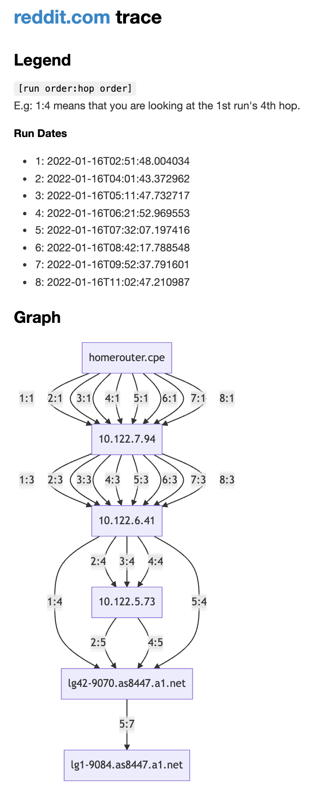

# Trace Vis

## Rationale

Solution for a networking course university assignment to visualize how the routes to a given target domain change over
time. Used technology:

- `Python 3.10`: to develop the application
- `traceroute`: to trace the routes to the target domain
- [`mermaid.js`](https://mermaid-js.github.io/mermaid/#/): to visualize the routes
- [`mume`](https://github.com/shd101wyy/mume): to render markdown into static HTML

Example result:



## Setup

This project uses Python 3.10 features (because why not?), so you will need to have Python 3.10 installed.

Create a virtual environment and install the requirements:

```shell
python3 -m venv venv
source venv/bin/activate
pip install -r requirements.txt
```

## Running

### Generating Traces

The target domains are defined as a static list in `trace_vis/main.py`, as `targets`. You can edit this list, or just
accept that they are the defaults.

You can start the trace generation by running:

```shell
python -m trace_vis.main
```

This will spawn a process which will trace the domains in `targets` every 10 minutes. The results will be stored
into `trace_runs.json`. If you feel like you gathered enough data, you can stop the process (very gracefully) by
hitting: `Ctrl-C`.

After this, you will have to fix he JSON file manually, by placing all the lists into a single list, and removing the
last trailing comma.

### Generating Graphs

Graphs are generated by [`mermaid.js`](https://mermaid-js.github.io/mermaid/#/), and the final markdown output is
rendered by [`mume`](https://github.com/shd101wyy/mume), the engine behind the
marvelous [`vscode-markdown-preview-enhanced`](https://github.com/shd101wyy/vscode-markdown-preview-enhanced).

As you have probably already guessed, these libraries lead us into the realms of `node_modules`.

#### Generate Markdown

You can generate markdown files by running:

```shell
python -m trace_vis.vis
```

The files will be located in `./md/`.

#### Render HTML

You can render the markdown files by installing the necessary `npm` packages and executing the `build` command:

```shell
cd md
npm i
npm run build
```

A single `index.html` file will be generated in the `./md/` directory.

## Disclaimer

This project was created in ~1 hour to solve a sub-problem of a university assignment. I am aware of various points
where this tool could be enhanced, such as using Jinja templating to generate the markdown output, or to add a CLI, to
mention the least. Oh, and comments: adding more comments would have been nice too. These are TODOs for an idealistic (
yet improbable) future, in which I do not abandon this project after the assignment's submission deadline.